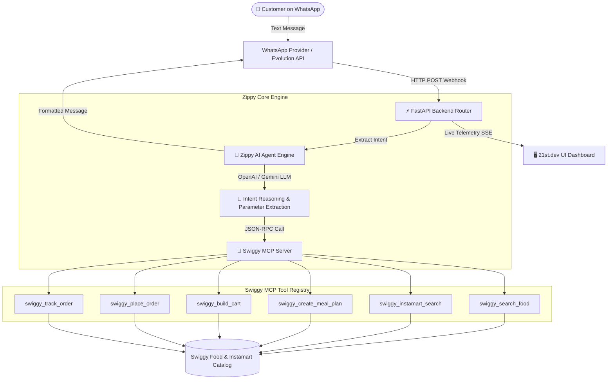
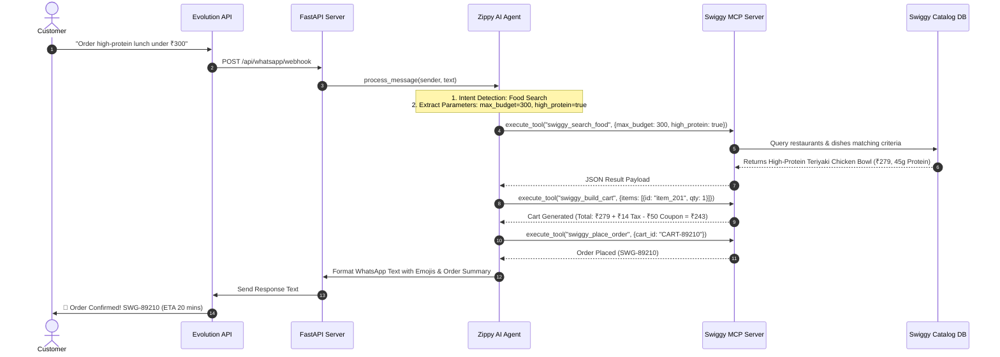

# ⚡ Zippy — WhatsApp-Based AI Assistant for Automated Swiggy & Instamart Ordering

> **Transforming simple WhatsApp text messages into real-world Swiggy food & grocery orders in seconds.**

[](https://fastapi.tiangolo.com)
[](https://reactjs.org)
[](https://swiggy.com)
[](https://github.com/EvolutionAPI/evolution-api)

---

## 🎯 What Problem Are We Solving?

### The Friction in Traditional Food & Grocery Ordering
Today, when a customer wants to order food or groceries, they face significant friction:
1. **Decision Fatigue & Endless Scrolling**: Spending **20 to 30 minutes** browsing hundreds of restaurants and grocery categories.
2. **Manual Rating & Review Comparison**: Reading customer reviews across multiple places trying to judge quality and portion size.
3. **Discount & Coupon Hunting**: Manually trying 5-10 coupon codes to figure out which one provides the best price reduction.
4. **Macro & Budget Friction**: Fitness-conscious users have to manually calculate calories, protein, and costs for every single dish.

### 💡 The Zippy Solution: "Message-to-Action"
**Zippy** eliminates all this friction by acting as a personalized AI Concierge on WhatsApp. Instead of opening apps and clicking dozens of buttons, the customer simply sends a single natural text message:

> *"Order me a high-protein lunch under ₹300 in Indiranagar"*

Zippy's AI agent instantly interprets intent, checks real-time Swiggy catalog ratings, computes optimal protein/calorie values, automatically applies discounts, builds the cart, and executes the order end-to-end.

---

## 🤝 Win-Win Value Proposition

| For Customers 🙋‍♂️ | For Merchants & Swiggy 🚀 |
| :--- | :--- |
| **Saves 25+ Minutes**: Zero app switching or manual searching. | **Higher Order Conversion**: Removes drop-offs during long searches. |
| **Instant Personalization**: Matches exact budget, dietary preferences, and macro targets. | **Automated Meal Planning**: Increases multi-item basket sizes. |
| **Auto-Best Price**: Automatically calculates taxes, delivery fees, and top coupon discounts. | **Zero Friction Channel**: Customers order directly inside WhatsApp where they spend most of their time. |

---

## 🛠️ Tech Stack

### Backend Infrastructure
- **Framework**: Python 3.12, FastAPI, Uvicorn
- **AI Agent Engine**: OpenAI (GPT-4o-mini) & Google Gemini (2.5-Flash) Tool Calling Integration
- **MCP Server**: Swiggy Model Context Protocol (MCP) Standard Implementation
- **WhatsApp Integration**: Evolution API (Open-source WhatsApp Engine) & Twilio Webhook Router
- **Data Validation**: Pydantic v2, HTTPX

### Frontend Application (21st.dev UI)
- **Framework**: React 18, Vite, TypeScript
- **Styling**: Tailwind CSS, Custom Dark Glassmorphic Design System (`#0B0F17`, Swiggy Orange `#FF6600`, Glowing Emerald `#10B981`)
- **Icons**: Lucide React

---

## 📐 Architecture & Low-Level Design (LLD)

### 1. High-Level System Architecture



---

### 2. Low-Level Execution Sequence Diagram



---

## 🎬 How to Run a Demo

For complete step-by-step instructions on running the Web UI sandbox and testing prompt scenarios, see our dedicated demo guide:

📖 **[Read the Demo Guide (DEMO.md)](file:///workspaces/Zippy/DEMO.md)**

---

## 📂 Repository Structure

```text
Zippy/
├── backend/
│   ├── agent/
│   │   └── agent_engine.py       # AI Agent & Intent Parser
│   ├── mcp/
│   │   ├── swiggy_mcp_server.py  # Swiggy MCP Tool Execution Server
│   │   └── swiggy_catalog.py     # Authentic Swiggy & Instamart Data
│   ├── whatsapp/
│   │   └── whatsapp_service.py   # Evolution API & Twilio Client
│   ├── api/
│   │   └── routes.py             # FastAPI Endpoints
│   ├── config.py                 # Configuration Settings
│   └── main.py                   # FastAPI Application Entrypoint
├── frontend/
│   ├── src/
│   │   ├── components/
│   │   │   ├── Navbar.tsx
│   │   │   ├── WhatsAppSimulator.tsx
│   │   │   ├── SwiggyCatalogExplorer.tsx
│   │   │   ├── AIMealPlanner.tsx
│   │   │   ├── MCPTelemetryInspector.tsx
│   │   │   ├── LiveOrderTracker.tsx
│   │   │   └── ConfigModal.tsx
│   │   ├── services/
│   │   │   └── api.ts            # API Client
│   │   ├── App.tsx
│   │   └── index.css             # 21st.dev Glassmorphism Styles
│   ├── index.html
│   ├── package.json
│   └── vite.config.ts
├── .env.example
├── DEMO.md                        # Walkthrough & Testing Scenarios
└── README.md                      # Project Documentation
```

---

## ⚡ Quick Start

1. **Start Backend**:
   ```bash
   cd backend && python3 -m uvicorn backend.main:app --host 0.0.0.0 --port 8000
   ```

2. **Start Frontend**:
   ```bash
   cd frontend && npm run dev
   ```

3. **Open Application**: Navigate to `http://localhost:3000`
